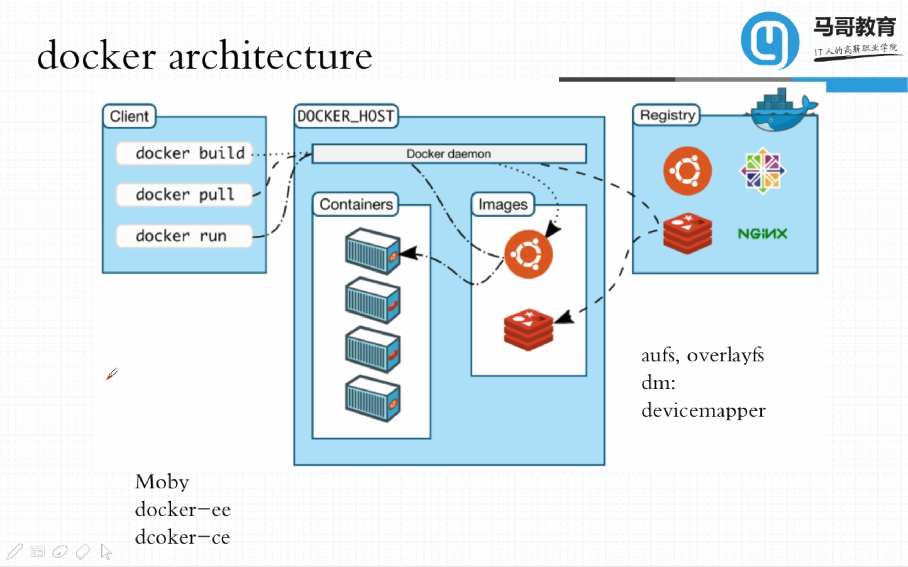
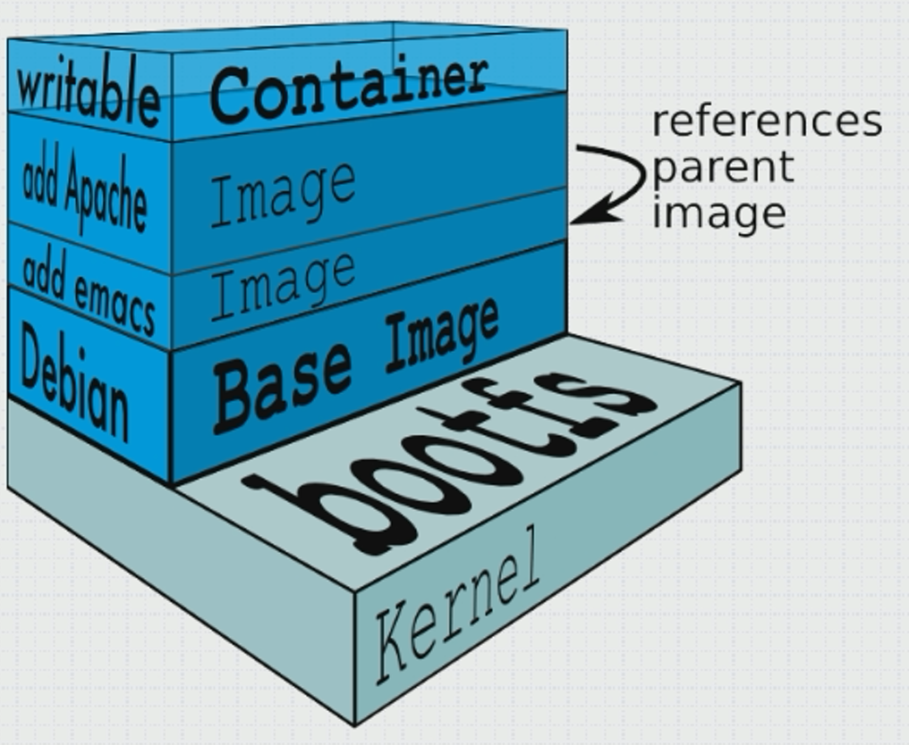
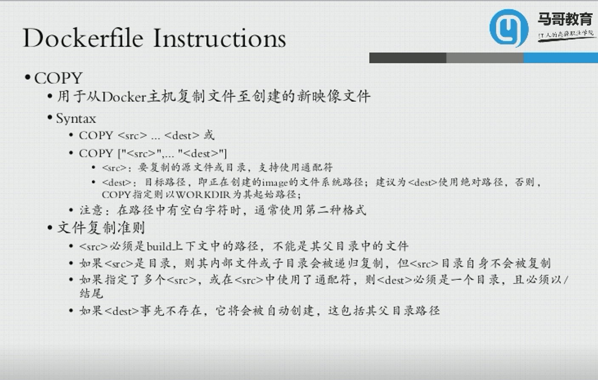
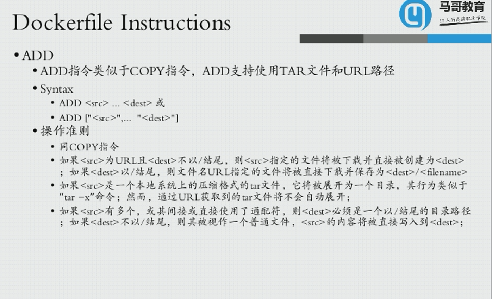

# :computer: ​Docker笔记

## :house:Docker的架构


  :mag: docker的架构分为三部分

1. client—docker客户端；

2. host—docker主机；

3. registry—docker镜像仓库。

:thinking: ​在docker的host中有一个守护进程daemon来管理`container`容器和`image`镜像。其中`image`和`container`的关系就相当于*程序和进程的关系*。

## :key:Docker命令

> docker 的命令分为两层结构

```bash
docker image <...>     # 管理image镜像的命令
docker container <...> # 管理container容器的命令
```

:mag:比如，以下的命令

```bash
docker image pull nginx:alpine # 从registry中拉取一个镜像
							   # alpine代表是一个最小化的镜像
```

```bash
docker container run --name b1 -it busybox	# 启动新的一个容器
											# busybox 内可以运行大多数的linux命令
											# -i interactive交互式
											# -t 分配一个tty，即终端
											# -it 可以在终端交互式操作容器
```

```bash
docker container exec -it b1 /bin/sh	# 对指定容器执行一个命令
										# 这里会进入b1容器的shell
```

:mag:其他常用命令

```dockerfile
docker container inspect b1	# 显示容器的详细信息
```

```dockerfile
docker container logs b1	# 显示日志
```

## :house:Docker镜像的管理

### :point_right:关于docker镜像

- **分层构建**：bootfs -> rootfs


- **联合挂载**：父镜像均为“只读”层，最上层为“可读写层”




### :point_right:获取远程registry的镜像

```shell
docker pull quay.io/coreos/flannel 	# 从quay这个registry的coreos命名空间
								# 下载flannel镜像
```

### :point_right:镜像制作的途径

1. Dockerfile
2. 基于容器制作镜像
3. Docker Hub自动构建

### :key:基于容器制作镜像

:mag:制作镜像

``` shell
docker container commit -p b1	# 基于容器b1制作image
								# -p 暂停正在run的image
```

```shell
# 给镜像打标签
docker tag 38baa824e342 mageedu/httpd:v0.1	# 根据id
docker tag megeedu/httpd:v0.1 megeedu/httpd:latest
```

```shell
docker commit -a "MageEdu <mage@magedu.com>" \ # 指定作者
              -c 'CMD: ["/bin/httpd", "-f", "-h", "/data/html"]'\ # 修改dockfile
              -p \ 
              b1 megeedue/httpd:v1.0
```

:mag:推送到docker hub

1. 首先登录到docker hub账号

```shell
docker login -u fadingling	# 通过用户名登陆docker hub
							# 然后会提示输入密码
```

2. 将自己commit的image推送到docker hub

```shell
docker push fadinglight/httpd
```

> 若要指定其他服务器，例如阿里云，需要登陆和推送时加上阿里云服务器

:mag:镜像的导入与导出

镜像的导出

```shell
docker save -o myimgs.gz fadinglight/httpd:v0.1-1 fadinglight/httpd:v0.2
```

> inux的scp命令，远程文件文件拷贝

镜像的导入

```shell
docker load -i myimgs.gz
```

## :house:docker容器网络

### :point_right:1. 封闭式容器(无虚拟网卡)

```shell
docker run --name t1 \ 
				-it \
                --network none \
                --rm \	# 退出shell自动stop
                busybox
```

### :point_right:2. 桥接式网络容器(默认)

```shell
docker run --name t1 \
				-it \
				--network bridge \
				--rm \
				busybox
```

:thinking:**Opening inbound commmunication**(==端口映射==)

`-p`参数暴露容器端口

1. 动态映射

```shell
docker run --name web \
				-d \ 	# 后台运行
				-p 80 \ # 暴露80端口，映射到主机的动态端口
				nginx:alpine
```

```shell
docker port web	# 查看端口
# 输出: 80/tcp -> 0.0.0.0:49160
```

`iptable`

2. 指定主机端口

```shell
docker run --name web \
				-d \ 			# 后台运行
				-p 8080:80 \	# 将80端口映射到主机的8080端口
				nginx:alpine
```

```shell
docker port web # 查看端口
# 输出: 80/tcp -> 0.0.0.0:8080
```

3. 指定主机ip

```shell
docker run --name web \
				-d \ # 后台运行
				-p 172.26.253.41::80 \ # 将80端口映射到主机指定ip的动态端口
				nginx:alpine
```

```shell
docker port web # 查看端口
80/tcp -> 172.26.253.41:49153
```

4. 指定主机ip加端口

```shell
docker run --name web \
				-d \ 						# 后台运行
				-p 172.26.253.41:8080:80 \ 	# 将80端口映射到主机指定ip的8080端口
				nginx:alpine
```

#### :thinking:**注意**问题

---

  在Windows10的`wsl`(Windows SubLinx)中使用docker，映射了端口到全部ip，下面是docker命令

```shell
docker run --name web -p 8080:80 nginx:alpine
```

在`windows`中可以使用`localhost:8080`来访问，但是不能使用`本机IP`来访问，可以使用`wsl的虚拟IP`来访问。

:point_down:

接下来，我使用docker映射到`wsl的虚拟IP`

```shell
docker run --name web -p 172.26.53.55:8080:80 nginx:alpine
```

在`windows`中不能使用`localhost:8080`来访问了，也不能用`本机IP`来访问，可以使用`wsl的虚拟IP`访问。

:point_down:

最后，我是用环回地址`127.0.0.1`

```shell
docker run --name web -p 127.0.0.1:8080:80 nginx:alpine
```

在`windows`中可以使用`localhost`来访问了，当然可以用`127.0.0.1`来访问

:v:**我得出结论**

第一种docker中默认暴露端口到全部端口，之所以windows中能使用`localhost`来访问，是因为端口也暴露在环回地址`127.0.0.1`之下，也就是说虚拟机和主机环回地址是通用的。

> `localhost`就代表环回地址`127.0.0.1`;
>
> 但是还有一个问题，使用ipv6的环回地址不能访问?

我还知道了，`wsl`其实就是虚拟机，可以在外部使用虚拟机的ip访问。但是要想使用其他主机访问，肯定还需要端口映射或者其他技术。

:mag:**但我发现了另一个问题**

为什么`wsl`里的ip地址和`windows`里显示的`wsl`的ip不同？

这里我暂且得出结论:point_down:

windows里面显示的wsl适配器，指的是所有wsl虚拟机的网关，是所有wsl虚拟机共用的。

而wsl内部显示的ip是此wsl的虚拟网络ip

:point_down:

关于`docker0`网桥，使所有的docker容器工作在同一个网段，其ip是可以更改的。

---

### :point_right:3. 容器共享网络名称空间

- 第一个容器`b1`

```shell
docker run --name b1 \
		   -it \
		   --rm \
		   busybox
```

- 第二个容器`b2`

```shell
docker run --name b2 \
			--network container:b1 \
			-it \
			--rm \
			busybox
```

:mag: `b2`共享了`b1`的网络空间，但是不共享文件系统。

### :point_right:4. 容器共享宿主机网络空间

```shell
docker run --name b3 \
			--network host \ # 共享宿主机网络空间，即和宿主机共享ip地址
			-it \
			--rm \
			busybox
```

:mag:这样直接通过宿主机ip+port访问，无需桥接。

## :house:Docker存储卷

> `卷(volume)`，是容器上的一个或者多个“目录”，与宿主机上的某目录建立绑定关系

:point_right:Docker有两种类型的卷

1. Bind mount volume——用户指定

2. Docker-managed volume​——docker管理的卷，特定目录

### :point_right:容器中使用Volume

1. **docker-managed volume**:point_down:

```shell
docker run --name b1 \
			-it 
			-v /data	# -v 指定容器存储卷的路径，目录不存在自动创建
			busybox
```

查看容器的卷相关信息

```shell
docker inpect -f {{.Mounts}} b1
```

输出:

```json
[{volume f10061f91e30c606498ef1907af7688d5135e2d6b4b12c849329d9a5fa57d978 /var/lib/docker/volumes/f10061f91e30c606498ef1907af7688d5135e2d6b4b12c849329d9a5fa57d978/_data /data local  true }]
```

可以看到宿主机上的目录

2. **bind mount volume**:point_down:

```shell
docker run --name b2 \
			-d 
			-it 
			-v /docker/data:/data  # -v 将容器的/data目录绑定到宿主机的/docker/data目录上
			busybox
```

查看相关信息

```shell
docker inspect -f  {{.Mounts}} b2
```

输出

```shell
[{bind  /docker/data /data   true rprivate}]
```

### :point_right:共享存储卷

>  可以让多个容器共享同一个存储卷

- 多个容的卷使用同一个主机目录；
- 复制其他容器的卷

```shell
docker run -itd \
			--name b3 \
			--volumes-from b2 \ # 复制b2的存储卷
			busybox
```

## :house: Dockerfile

> build docker image
>
> - 格式
>
>   - \# 注释
>
>   - INSTRUCTION arguments
>
> - 不区分大小写，约定大写
>
> - 顺序执行
>
> - 第一个指令必须是`FROM`，来指定基础镜像

### :point_right:环境变量替换

1. **${variable:-word}**——如果`$variable`存在则返回`$variable`，不存在则返回`word`；
2. **${variable:+word}**——如果`$variable`存在则返回`word`，不存在则返回`空`。

### :point_right:Dockerfile指令

#### :key:FROM

> 写在第一行，指定基础镜像

```dockerfile
FROM busybox:latest			# 第一种
FROM busybox@123ads14214	# 第二种加哈希码
```

#### MAINTANIER(depreacted)

> 作者信息

```dockerfile
MAINTAINER "clz <clz@clz.com>"
# 或者
LABEL maintainer="clz <clz@clz.com>"
```

#### LABEL:point_up:

> LABEL <key>=<value> <key><value>

#### COPY

> 复制主机文件到镜像
>
> 

```dockerfile
COPY index.html /data/html/ 
```

 ​

---

#### :thinking: ​**构建镜像的命令`build`**

```shell
docker build -t tinyhttpd:v0.1-1 ./
```

---

#### :key:ADD

> 类似于COPY
>
> 
>
> 可从URL下载，但要注意tar文件的处理方式。


#### WORKDIR

> 改变当前工作目录

```dockerfile
WORKDIR /usr/local/src/
```

#### VOLUME

> 指定挂载卷，只能指定容器中的卷目录

```shell
VOLUME /data/mysql/
```

#### EXPOSE

> 指定可以开放的端口，而不打开
>
> `run`的时候使用`-P`来开放

```dockerfile
EXPOSE 11211/tcp 11211/udp
```

#### :key:ENV

> 环境变量，也可以被其他指令引用`$variable`或`${variable}`
>
> ENV <key> <value> 或
>
> ENV <key>=<value>  <key>=<value> ...

```dockerfile
ENV DOC_ROOT=/data/web/html/ \
    WEB_SERVER_PACKAGE="nginx-1.15.2"
```

#### :key:RUN

>  `build`时运行命令
>
>  - 第一种格式一般是一个shell命令，会以`/bin/sh -c`来运行。意味着，此进程在容器中的PID不为1，不能接收Unix信号，当`docker stop`时，此进程接收不到SIGTERM信号；
>  - 第二种格式参数是一个JSON数组，不会以`/bin/sh -c`运行，即不是shell命令。

```dockerfile
# 第一种格式
RUN cd /usr/local/src && \
    tar xf ${WEB_SERVER_PACKAGE} && \
    mv nginx-* webserver

# 第二种格式
RUN ["/bin/bash", "-c", "<exectutable>", "<param1>"]
```

#### :key:CMD

> `run`时运行命令，类似`RUN`
>
> - 多个时仅最后一个生效
>
> - 可在`run`时被顶替
> - 三种格式，前两种同`RUN`，第三种为`ENTERPOINT`提供默认参数

```dockerfile
# 第三种格式
CMD ["param", "param"]
```

```dockerfile
CMD /bin/httpd -f -h ${WEB_DOC_ROOT}
```

:point_up:但是`CMD`会默认替换为PID为1的进程​

#### :key:ENTRYPOINT

> 类似CMD功能，为容器指定默认运行程序
>
> 不会被docker run 命令指定的参数覆盖
>
> docker run 传入的命令参数会覆盖CMD指令的内容并覆盖到ENTRYPOINT后作为参数

```dockerfile
ENTRYPOINT <command>
ENTRYPOINT ["<executable>", "<param1>",...]
```

:key:可以写一个`entrypoint.sh`脚本，再使用`ENTRYPOINT`来执行。

#### USER

> 指定用户名|UID，默认root

#### HEALTHCHECK

> 检测容器健康与否
>
> --interval=DURATION(default:30s)
>
> --timeout=DURATION(default:30s)
>
> --start-period=DURATION(defaulr:0s)
>
> --retries=N(default:3)

#### SHELL

> 使用默认shell

#### STOPFIGNAL

#### AGE

> - `build`时使用的参数
>
> - 然后使用`--build-arg`指定参数

#### ONBUILD

> - 触发器
>
> - 被其他镜像`FROM`后，执行

## :house:Docker私有registry

1. 建立私有registry，使用`docker-distribution`在本机建立registry;
:point_down:
2. `harbor`项目，基于`docker-distribution`，有web界面;

### :point_right:Docker Compose

> 容器编排工具

## :house:Docker资源限制

> memory, CPU, block IO等

### :point_right:memory

> 官方文档-> https://docs.docker.com/config/containers/resource_constraints/#memory

### :point_right: CPU

> 官方文档-> https://docs.docker.com/config/containers/resource_constraints/#cpu

### :key:查看容器占用的资源

```shell
docker stats	# 显示容器使用的资源, 动态
docker top db1	# 
```