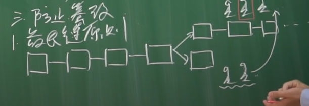

# 关于区块链

比特币 区块链

以太坊 智能合约

## 一. 比特币：数字货币

1. 2008年11月1日，中本聪（网名），《白皮书》；

2. 去中心化的电子**记账**系统；

   在交易的时候，最重要的时记账。

   一般交易的时候时银行记账，因为我们信任银行；

   

   比如ABCD四个人相互之间的交易，把交易记录记录起来就形成一个区块，一个区块可以存4000条记录。

因此有几个问题？1）以谁为准；2）为何记账；3）防止篡改；

3. 为什么记账？

   记账有奖励：1. 手续费；2. 打包奖励；

   关于**打包奖励**：

   - 每十分钟一个包，一个包50个比特币；

   - 每四年奖励减半，即第二个四年一个包25个比特币，第三个四年一个包12.5个比特币

   算下来，
   $$
   50 * 6 * 24 * 365 * 4 * (1 + \frac{1}{2} + \frac{1}{2}^2 + ... ) = 2100万
   $$

4. 以谁为准：工作量证明（挖矿）

## 二. 挖矿原理

1. 哈希函数： Sha256函数

   Sha256('apple') = 10100111... (一共256位)

   反向算困难，几乎无法破解。

2. 原理：

   2.1 string = 前块头部 + 账单 + 时间戳 + **随机数**

   2.2 Hash = Sha256(Sha256(string))

   2.3 要求前n位必须是0，然后才能打包

   2.4 只有随机数可以改变

4. 难度n怎么确定

   为了保证每十分钟出一个区块——通过调整n值

## 三. 防伪

### 1. 身份认证

- 传统： 1. 人脸；2. 签名；3. 指纹；但是在计算机上都是可以伪造的；

- 电子签名：

  非对称加密: 典型的RSA

  

  电子签名

### 2. 双支付问题

#### 2.1 余额检查：追溯	

​	顺着区块链查询计算余额

#### 2.2 双重支付

​	不同的人接受到消息的顺序不同，余额不足的记录会被抛弃，至于哪个人的顺序会被采用，就是看谁最先打包成块。

#### 2.3 防止篡改

 1. 最长链原则

    

2. 防篡改

   与全世界的人进行对抗

   

## 四. 小结

​	比特币作为一种技术手段是非常新颖而且漂亮的，比特币没有中心发行机构，不用担心主权危机，比特币总量固定不会存在滥发的风险，比特币天生具有防伪的属性，而且可以追溯，比特币交易的时候手续费非常低，有人甚至提名中本聪甚至可以获得诺贝尔经济学奖；但是又因为比特币是一种匿名的货币，他在进行交易的时候只需要一个公钥和一个地址，所以给了很多犯罪分子提供了可乘之机，比如很多犯罪分子利用比特币进行敲诈，进行贩毒，进行洗钱等等这样的活动，也收到了一些政府部门的打击；还有一些人把比特币当作投机手段，比特币暴涨暴跌造成了很多人一夜暴富，也有很多人倾家荡产。应该把比特币看作是一种技术手段，如果要购买比特币，也应该从投资而不是投机的角度

