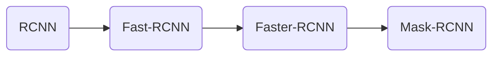

# RCNN网络家族简介

## RCNN

### 算法流程

> 传统的滑动窗口算法，计算量巨大，RCNN为了解决这个问题，提出了`Region Proposal`(候选区域)这个概念。

具体的流程如下：

1. 对于一张图像，使用选择搜索算法(Select Search)从图像中提取2K个区域，称为候选区域(Region Proposal);

2. 将这2K个Proposal resize成相同大小的正方形图像，然后输入到CNN中，分别输出4096维度的特征想向量；

3. 最后使用SVM算法分类区域中的对象，并使用回归器精细修正候选框位置。

其中，流程1中的Select Search算法的具体流程如下：

1. 使用分割算法，将图像分割成小区域；

2. 使用贪心算法将小区域递归组合成更大的区域；

3. 使用生成的区域生成最终的proposal。

### RCNN算法的优缺点

RCNN将CNN首次引入了目标检测领域。

但是也存在一些缺点，最主要的就是慢，一张图片要47s；而且，Select Search算法是一种固定的算法，这个阶段无法学习，这可能会导致糟糕的region proposal。

## Fast-RCNN

> RCNN的作者为了解决RCNN存在1的一些问题，构建了新的算法Fast-RCNN。

## Faster-RCNN

