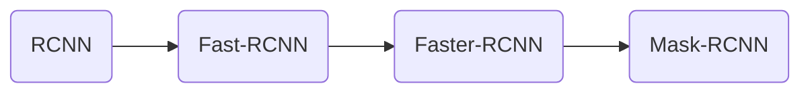
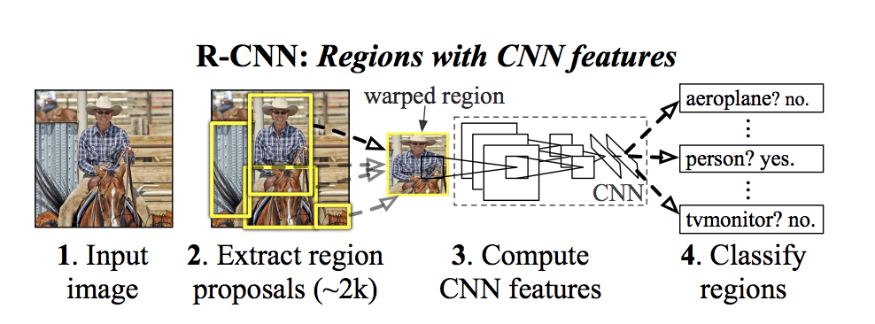

# RCNN网络家族简介

```mermaid
graph LR;
    rcnn(RCNN)-->fast-rcnn(Fast-RCNN)-->faster-rcnn(Faster-RCNN)-->mask-rcnn(Mask-RCNN)
```

## RCNN

传统的滑动窗口算法，计算量巨大，RCNN为了解决这个问题，提出了`region proposal`(候选区域)这个概念。

具体的流程如下：
1. 对于一张图像，

## Fast-RCNN

## Faster-RCNN

